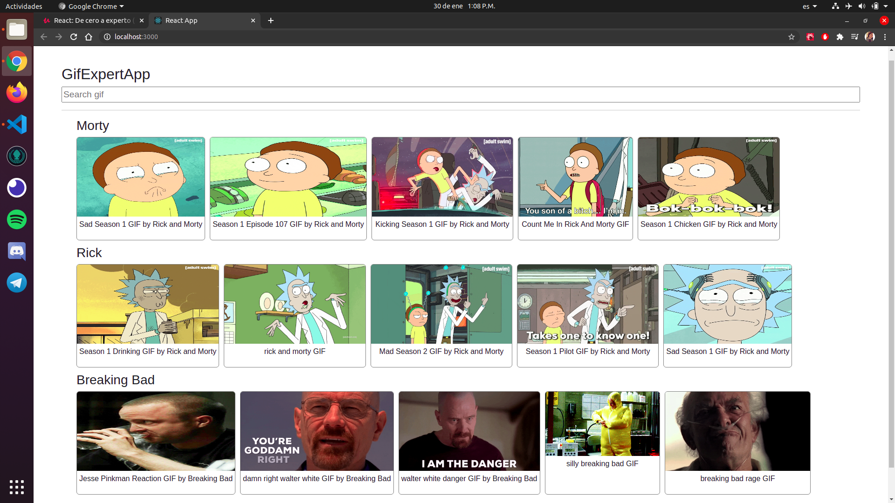

# Imágenes del producto final

### Se cuenta con un componente padre quien es el que envuelve todos los componentes hijos. Dentro de la aplicación existen 4 componentes que se comunican entre sí, lo que hace que mantener el código y el orden del mismo sea más fácil.